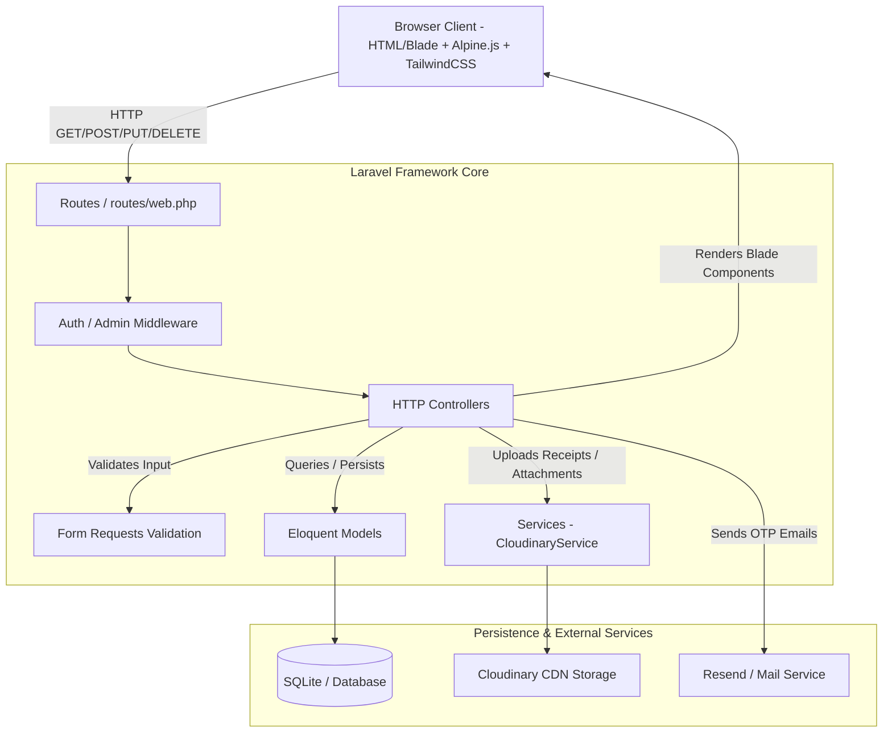
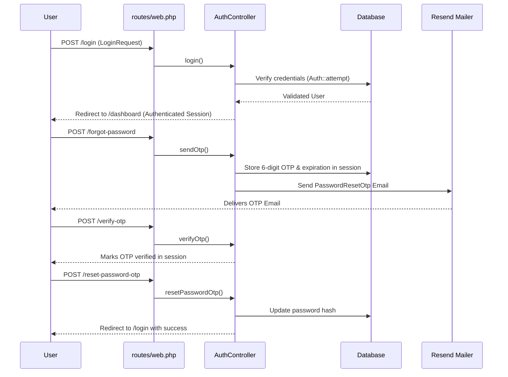

# System Architecture

## Architecture Diagram

## Data Flow

1. **User Interaction**: User interacts with Blade views enhanced by Alpine.js modals, reactive dropdowns, and Chart.js graphics.
2. **Request Dispatching**: Form requests (POST/PUT/DELETE) or GET pages are sent to `routes/web.php`.
3. **Middleware & Authentication**: `auth` or `AdminMiddleware` verifies session state and role permissions before invoking Controller actions.
4. **Validation**: Specialized `FormRequest` classes (e.g. `ExpenseStoreRequest`, `ProfileUpdateRequest`) validate and sanitize incoming inputs.
5. **Business & Storage Logic**:
   - `ExpenseController` / `IncomeController` interact with `Expense` & `Income` Eloquent models.
   - Files uploaded (receipts, avatars, support attachments) pass through `CloudinaryService` to generate CDN URLs.
   - OTP emails pass through `PasswordResetOtp` Mailable.
6. **Response / View Rendering**: Controllers render Blade layouts (`<x-app-layout>`) passing structured collections to component templates.

## Auth Flow

## Folder Responsibility Map

| Folder | Responsibility |
| --- | --- |
| `app/Http/Controllers/` | Handlers for HTTP requests, business logic orchestration, and response compilation |
| `app/Http/Requests/` | Input validation, authorization rules, and data formatting for forms |
| `app/Http/Middleware/` | Guards routes (e.g. `AdminMiddleware` checking `is_admin` flag) |
| `app/Models/` | Eloquent ORM entity definitions, relationships, scopes, and casts |
| `app/Services/` | External API integrations (e.g., Cloudinary image upload/delete service) |
| `app/Mail/` | Transactional email definitions and Blade template pairings |
| `app/Policies/` | Fine-grained resource authorization policies (e.g., `ExpensePolicy`) |
| `database/migrations/` | Database table structure schema migrations |
| `resources/views/` | Blade templates, pages, layouts, and reusable UI components |
| `routes/web.php` | Routing hierarchy, route parameter matching, and middleware assignment |
