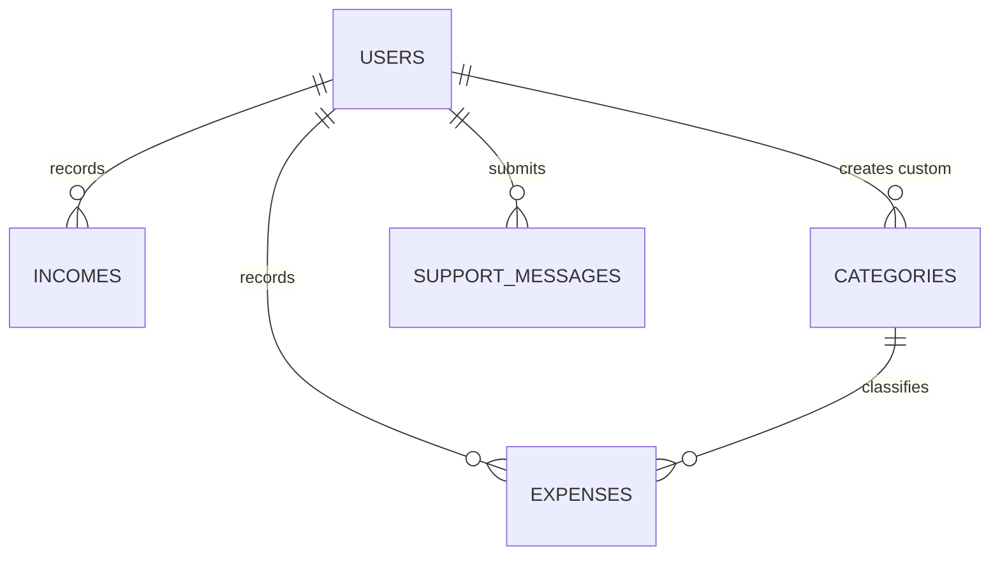

# Database Schema & Models

The application uses Laravel Eloquent ORM. Supported databases: SQLite (default), MySQL, PostgreSQL.

## Entity Relationship Summary

---

## 1. `users` Table (`App\Models\User`)

Stores user credentials, preferences, monthly budget thresholds, and authorization roles.

| Column | Type | Attributes | Description |
| --- | --- | --- | --- |
| `id` | `bigint` | Primary Key, Auto Increment | Unique User ID |
| `name` | `string` | Required | Full Name |
| `username` | `string` | Unique, Nullable | Unique Username |
| `email` | `string` | Unique, Required | User Email |
| `email_verified_at` | `timestamp` | Nullable | Email verification timestamp |
| `password` | `string` | Required | Hashed Password |
| `profile_pic` | `string` | Nullable | Cloudinary URL for profile avatar |
| `monthly_budget` | `decimal(10,2)` | Default: `0.00` | Monthly spending limit |
| `budget_warn_limit` | `integer` | Default: `80` | Warning threshold percentage (e.g. 80%) |
| `theme_color` | `string` | Default: `#2563eb` | Primary UI Accent Color |
| `dark_mode` | `boolean` | Default: `false` | Dark mode state |
| `is_admin` | `boolean` | Default: `false` | System Administrator Flag |
| `remember_token` | `string` | Nullable | Remember Me Token |
| `created_at` / `updated_at` | `timestamp` | Standard | Timestamps |

---

## 2. `categories` Table (`App\Models\Category`)

System default and user-created custom categories for expense and income classification.

| Column | Type | Attributes | Description |
| --- | --- | --- | --- |
| `id` | `bigint` | Primary Key, Auto Increment | Unique Category ID |
| `user_id` | `foreignId` | Nullable, Constrained `users` | Null for system defaults, User ID for custom categories |
| `name` | `string` | Required | Category Name |
| `type` | `enum` | `'expense'`, `'income'` | Category Type (default: `'expense'`) |
| `slug` | `string` | Required | URL-friendly slugified name |
| `icon` | `string` | Default: `'tag'` | FontAwesome Icon Class name |
| `color` | `string` | Default: `'#2563eb'` | Hex Color Code for Badges |
| `is_default` | `boolean` | Default: `false` | System-wide default flag |
| `status` | `string` | Default: `'active'` | `'active'` or `'inactive'` |
| `created_at` / `updated_at` | `timestamp` | Standard | Timestamps |

---

## 3. `expenses` Table (`App\Models\Expense`)

Records financial outgoing transactions.

| Column | Type | Attributes | Description |
| --- | --- | --- | --- |
| `id` | `bigint` | Primary Key, Auto Increment | Unique Expense ID |
| `user_id` | `foreignId` | Constrained `users`, Cascade Delete | Owner User ID |
| `category_id` | `foreignId` | Nullable, Constrained `categories`, Set Null | Optional link to Category model |
| `title` | `string` | Required | Expense Title / Item Description |
| `amount` | `decimal(10,2)` | Required | Monetary value (INR) |
| `category` | `string` | Required | Category Name string fallback |
| `date` | `date` | Required | Transaction Date |
| `payment_method` | `string` | Default: `'UPI'` | UPI, Card, Cash, Net Banking, Bank Transfer, Other |
| `notes` | `text` | Nullable | Additional context notes |
| `receipt_url` | `string` | Nullable | Cloudinary Document / Image URL |
| `receipt_public_id` | `string` | Nullable | Cloudinary asset public ID |
| `created_at` / `updated_at` | `timestamp` | Standard | Timestamps |

---

## 4. `incomes` Table (`App\Models\Income`)

Records incoming salary, freelance, or investment payouts.

| Column | Type | Attributes | Description |
| --- | --- | --- | --- |
| `id` | `bigint` | Primary Key, Auto Increment | Unique Income ID |
| `user_id` | `foreignId` | Constrained `users`, Cascade Delete | Owner User ID |
| `title` | `string` | Required | Income Title / Source Detail |
| `amount` | `decimal(10,2)` | Required | Monetary value (INR) |
| `source` | `string` | Required | Salary, Freelance, Investment, Business, etc. |
| `date` | `date` | Required | Deposit / Receive Date |
| `payment_method` | `string` | Default: `'Bank Transfer'` | Bank Transfer, UPI, Cash, Cheque, Crypto, Other |
| `notes` | `text` | Nullable | Context notes |
| `created_at` / `updated_at` | `timestamp` | Standard | Timestamps |

---

## 5. `support_messages` Table (`App\Models\SupportMessage`)

Stores user help desk tickets and support queries.

| Column | Type | Attributes | Description |
| --- | --- | --- | --- |
| `id` | `bigint` | Primary Key, Auto Increment | Unique Message ID |
| `ticket_number` | `string` | Unique, Required | Auto-generated ticket identifier (e.g. `TKT-A1B2C3D4`) |
| `user_id` | `foreignId` | Nullable, Constrained `users` | Submitting User ID |
| `name` | `string` | Required | Submitter Name |
| `email` | `string` | Required | Submitter Email |
| `subject` | `string` | Required | Ticket Subject |
| `message` | `text` | Required | Issue description |
| `attachment_urls` | `json` | Nullable | Array of Cloudinary attachment URLs |
| `attachment_public_ids` | `json` | Nullable | Array of Cloudinary asset public IDs |
| `status` | `enum` | `'open'`, `'in_progress'`, `'resolved'`, `'closed'` | Ticket status (default: `'open'`) |
| `created_at` / `updated_at` | `timestamp` | Standard | Timestamps |
